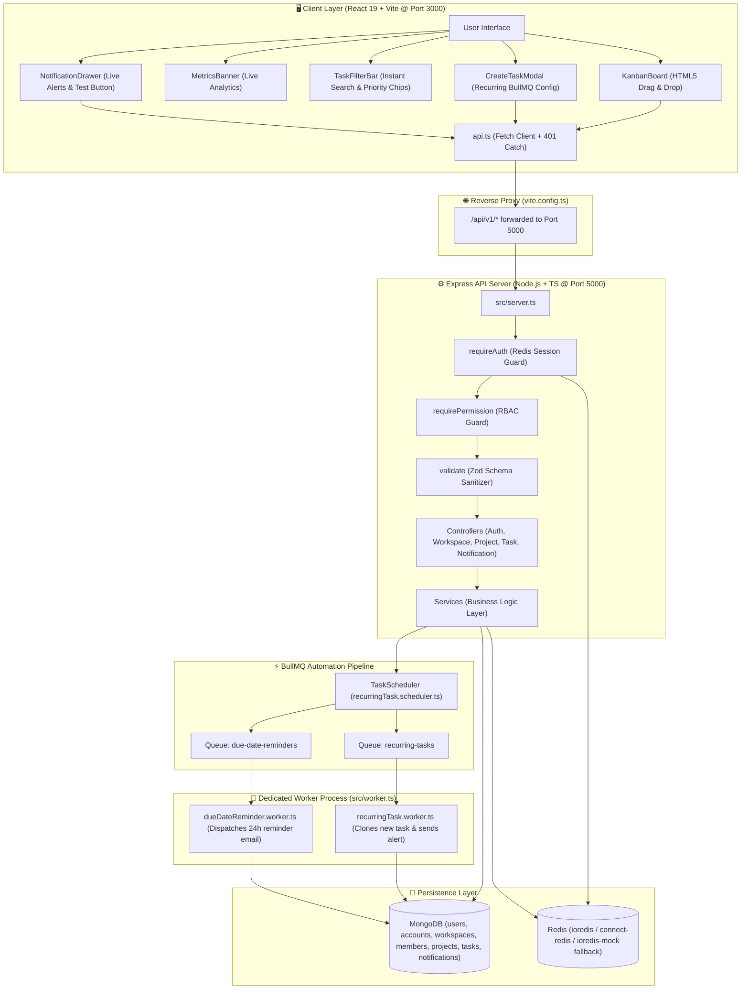

# Workflo 🚀

[](https://www.typescriptlang.org/)
[](https://nodejs.org/)
[](https://expressjs.com/)
[](https://react.dev/)
[](https://vitejs.dev/)
[](https://www.mongodb.com/)
[](https://redis.io/)
[](https://docs.bullmq.io/)

A production-grade, enterprise-ready team and task management platform featuring **asynchronous BullMQ background automation**, **declarative RBAC**, **native HTML5 Drag-and-Drop Kanban**, and a modern **React 19 dark-mode dashboard**.

---

## ✨ Features at a Glance

* **🏢 Multi-Tenant Workspaces:** Create separate workspaces for teams or join instantly using 8-character unique invite codes (e.g. `D614B779`).
* **🛡️ Strict Role-Based Access Control (RBAC):** Granular permissions split across `OWNER`, `ADMIN`, and `MEMBER` with \(O(1)\) authorization guards.
* **🖱️ Native Drag & Drop Kanban:** Grab and drop tasks across `To Do`, `In Progress`, `In Review`, and `Completed` with dynamic glowing dropzones.
* **⚡ BullMQ & Redis Automation:**
  * **Recurring Task Cloning:** Automated templates that automatically clone new task instances (Daily, Weekly, Monthly) via background cron schedules.
  * **Due-Date Reminders:** Delayed background jobs that send alerts and transactional emails 24 hours before deadlines.
* **📊 Live Metrics & Analytics Banner:** Real-time counters showing total tasks, in-progress items, review bottlenecks, completed work, and active automations.
* **🔍 Instant Search & Priority Filtering:** Filter tasks in real-time by title, description, or priority chips (`Urgent`, `High`, `Medium`, `Low`).
* **📱 100% Mobile & Tablet Responsive:** Collapsible navigation drawer with a hamburger menu, horizontal swipeable Kanban columns, and touch-adapted modals.
* **🔒 Decoupled Auth Security:** User profiles (`User`) and authentication hashes (`Account`) are separated into distinct models so password hashes physically cannot leak in user queries.

---

## 🏛️ System Architecture



---

## 📁 Repository Structure

```
workFlo/
├── package.json                      # Root scripts and production/dev dependencies
├── tsconfig.json                     # Strict TypeScript configuration
├── docs/schema-design.md             # In-depth MongoDB schema documentation & ER diagrams
│
├── src/                              # Backend TypeScript Source Code
│   ├── server.ts                     # Main Express server entry point
│   ├── worker.ts                     # Independent background worker entry point
│   ├── config/                       # Environment, MongoDB, Redis & Passport configuration
│   ├── controllers/                  # HTTP route handlers
│   ├── services/                     # Core business logic & database operations
│   ├── models/                       # Mongoose schemas (User, Account, Workspace, Task, etc.)
│   ├── routes/                       # Express route declarations (/api/v1/*)
│   ├── middlewares/                  # Auth, RBAC role guard, Zod validation, global error handler
│   ├── jobs/                         # BullMQ queues, schedulers & background workers
│   ├── types/                        # Role enum, permissions matrix & Express type augmentations
│   └── utils/                        # Structured logger, AppError, ApiResponse envelopes
│
└── client/                           # React 19 Frontend Dashboard
    ├── vite.config.ts                # Vite config with reverse proxy to Express port 5000
    ├── src/
    │   ├── main.tsx                  # React entry point
    │   ├── App.tsx                   # Top-level state orchestrator & 401 session recovery
    │   ├── index.css                 # Custom modern dark CSS, glassmorphism & media queries
    │   ├── services/api.ts           # Fetch client with auto-401 dispatch & credentials
    │   └── components/
    │       ├── AuthModal.tsx         # Sign in & registration modal
    │       ├── Sidebar.tsx           # Workspace switcher, invite code sharing, mobile drawer
    │       ├── Navbar.tsx            # Header, "+ Add Task", 🔔 notifications drawer, profile
    │       ├── KanbanBoard.tsx       # Native HTML5 Drag & Drop board with priority stripes
    │       ├── MetricsBanner.tsx     # Live statistics overview (Total, In-Progress, Done, etc.)
    │       ├── TaskFilterBar.tsx     # Instant search bar & priority filter chips
    │       ├── Toast.tsx             # Floating toast notification system
    │       ├── CreateTaskModal.tsx   # Modal with BullMQ recurring schedule config
    │       ├── CreateWorkspaceModal.tsx # Workspace creation dialog
    │       └── NotificationDrawer.tsx# Live notification alerts & test trigger
```

---

## 🚀 Quickstart & Setup

### 1. Prerequisites
* **Node.js:** v20+ or v22 LTS
* **MongoDB:** Running locally or via Atlas (`mongodb://127.0.0.1:27017/workflo`)
* **Redis:** Optional in dev (falls back seamlessly to in-memory `ioredis-mock` if Redis server is offline)

### 2. Installation
```bash
# Clone the repository
git clone https://github.com/suraj-6277/workFlo.git
cd workFlo

# Install backend dependencies
npm install

# Install client dependencies
cd client && npm install && cd ..
```

### 3. Environment Configuration
Copy `.env.example` to `.env`:
```bash
cp .env.example .env
```
Default development `.env`:
```env
PORT=5000
NODE_ENV=development
MONGO_URI=mongodb://127.0.0.1:27017/workflo
REDIS_URL=redis://127.0.0.1:6379
SESSION_SECRET=super_secret_session_key_1234567890
FRONTEND_URL=http://localhost:3000
```

### 4. Running the Application

Open two terminal tabs:

**Terminal 1 — Start the Backend API Server:**
```bash
npm run dev:api
# API server listening on http://localhost:5000
```

**Terminal 2 — Start the React Client Dashboard:**
```bash
cd client
npm run dev -- --port 3000
# Vite dev server running at http://localhost:3000
```

*(Optional) Terminal 3 — Start the Background Worker:*
```bash
npm run dev:worker
# Dedicated BullMQ worker listening for repeatable & delayed jobs
```

---

## 🧪 Test Credentials
* **Email:** `suraj@example.com`
* **Password:** `SecurePass123!`

---

## 📡 REST API Directory

All responses follow the standard JSON envelope:
`{ "success": true, "message": "...", "data": {}, "errors": [] }`

| Method | Endpoint | Access | Description |
| :--- | :--- | :--- | :--- |
| `POST` | `/api/v1/auth/register` | Public | Create new User & decoupled Account record |
| `POST` | `/api/v1/auth/login` | Public | Authenticate via Passport & issue session cookie |
| `POST` | `/api/v1/auth/logout` | Session | Terminate session & clear cookie |
| `GET` | `/api/v1/auth/me` | Session | Get authenticated user profile |
| `POST` | `/api/v1/workspaces` | Session | Create workspace & generate 8-char invite code |
| `GET` | `/api/v1/workspaces` | Session | List current user's workspaces |
| `POST` | `/api/v1/workspaces/join` | Session | Join workspace via invite code |
| `GET` | `/api/v1/workspaces/:wsId/projects` | `VIEW_WORKSPACE` | List projects in workspace |
| `POST` | `/api/v1/workspaces/:wsId/projects` | `CREATE_PROJECT` | Create project with custom hex color |
| `GET` | `/api/v1/workspaces/:wsId/tasks` | `VIEW_WORKSPACE` | Get paginated, filtered tasks |
| `POST` | `/api/v1/workspaces/:wsId/tasks` | `CREATE_TASK` | Create task & register BullMQ recurrence |
| `PATCH`| `/api/v1/workspaces/:wsId/tasks/:id` | `UPDATE_TASK` | Move Kanban status / update task |
| `DELETE`| `/api/v1/workspaces/:wsId/tasks/:id` | `DELETE_TASK` | Delete task & cancel reminder jobs |
| `GET` | `/api/v1/notifications` | Session | Get latest 50 notifications |
| `POST` | `/api/v1/notifications/test` | Session | Fire instant test alert |
| `PATCH`| `/api/v1/notifications/read-all` | Session | Mark all notifications read |

---

## 📖 Additional Documentation
* **[docs/schema-design.md](docs/schema-design.md):** Database schema, entity relationships, compound indexes, and cascade delete rules.

---

## 📄 License
Licensed under the [MIT License](LICENSE).
