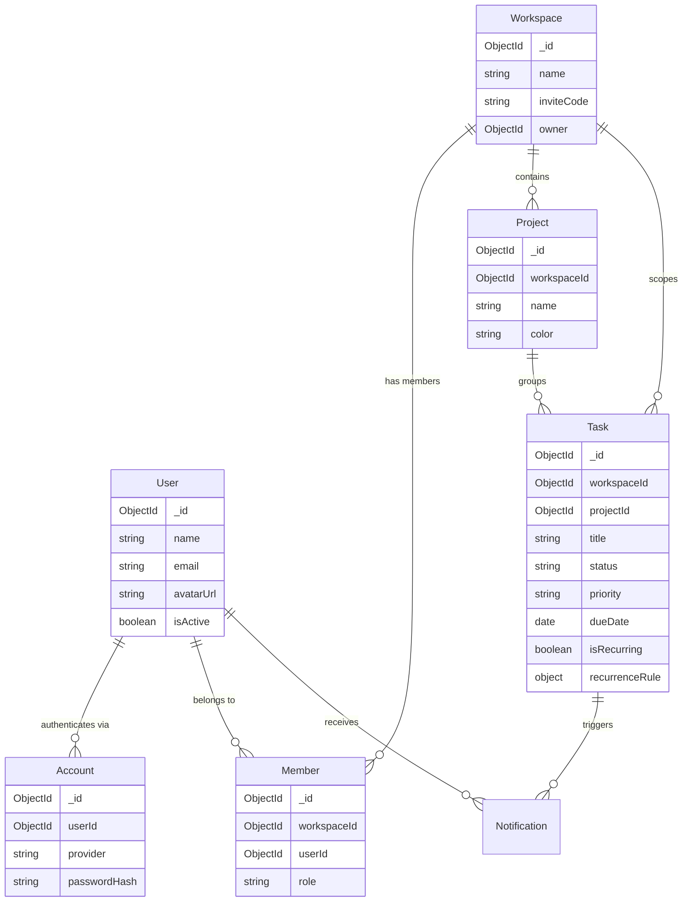
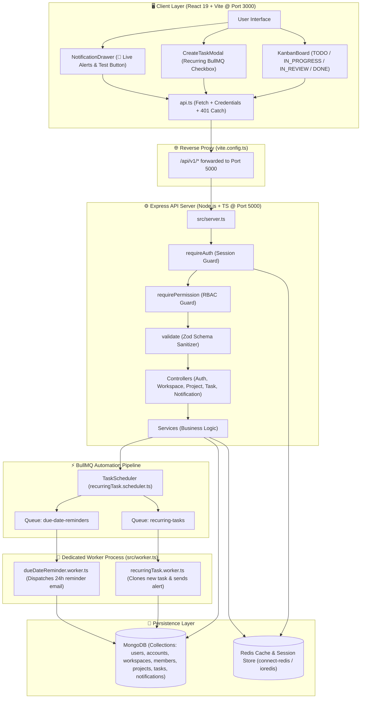

# 📖 Workflo: Complete Architectural Handbook & System Guide

Welcome to the definitive guide for **Workflo** — a production-grade, enterprise-ready collaborative task and project management platform built from scratch with **TypeScript, Node.js, Express, MongoDB, Redis, BullMQ, and React**.

This document covers everything about the project: the architectural decisions, tech stack, directory structure, detailed file map, request flow, API reference, background automation, and a visual master workflow diagram.

---

## 📑 Table of Contents
1. [What is Workflo?](#1-what-is-workflo)
2. [Why We Built Workflo (The Problem & Flaws in Prototypes)](#2-why-we-built-workflo)
3. [Technology Stack & Architectural Decisions](#3-technology-stack--architectural-decisions)
4. [Complete File Directory & Component Map](#4-complete-file-directory--component-map)
5. [How Files are Connected (System Flows)](#5-how-files-are-connected-system-flows)
6. [Complete API Reference & Route Matrix](#6-complete-api-reference--route-matrix)
7. [BullMQ Background Jobs & Workers](#7-bullmq-background-jobs--workers)
8. [Database Schema & Data Models](#8-database-schema--data-models)
9. [Frontend Architecture & State Flow](#9-frontend-architecture--state-flow)
10. [Master Workflow Diagram](#10-master-workflow-diagram)

---

## 1. What is Workflo?

**Workflo** is an asynchronous, multi-tenant workspace platform designed for engineering and product teams. It delivers:
* **Multi-Tenant Workspaces:** Users can create workspaces or join existing ones via unique 8-character invite codes (e.g. `D614B779`).
* **Role-Based Access Control (RBAC):** Strict permissions dividing members into `OWNER`, `ADMIN`, and `MEMBER`.
* **Projects & Kanban Board:** Nested project spaces with 4-column agile Kanban boards (`TODO`, `IN_PROGRESS`, `IN_REVIEW`, `DONE`).
* **Automated Background Jobs (BullMQ + Redis):** Automated recurring tasks (Daily/Weekly/Monthly cloning) and delayed due-date reminder notifications.
* **Modern Dark-Mode Frontend:** A reactive React 19 + TypeScript dashboard with live modals, notifications drawer, and real-time state syncing.

---

## 2. Why We Built Workflo

Earlier prototypes (such as "Zentra") suffered from several fatal architectural bugs common in junior-level full-stack projects:

| Common Flaw in Prototypes | How Workflo Fixes It |
| :--- | :--- |
| **Password hash leaked in `User` queries:** `User.find()` exposed bcrypt hashes if developers forgot `select('-password')`. | **Decoupled Auth Architecture:** `User` contains profile info only. All credentials live in a separate `Account` model. Passwords physically *cannot* leak in User queries. |
| **Workspace `owner` set to `Member._id`:** Circular references and orphan records when members left. | **Direct User Ownership:** `workspace.owner` strictly stores `User._id`. |
| **`req.params` overwritten by Zod:** Validation middlewares setting `req.params = parsed.params` wiped route IDs when validating request bodies. | **Selective Parameter Hydration:** Middlewares only touch `req.params` or `req.query` if those keys exist in the schema. |
| **`setInterval` timers in Express:** Timers lost on server reboots or duplicated across scaled containers. | **Decoupled BullMQ + Redis Queue:** Persistent background worker process (`worker.ts`) handles scheduling independently. |
| **IPv6 vs IPv4 Windows MongoDB connection:** Node 18+ resolves `localhost` to `::1`, failing to connect to local MongoDB. | **Explicit IPv4 Loopback:** Enforced `127.0.0.1` in environment and database config. |

---

## 3. Technology Stack & Architectural Decisions

### Backend Stack
* **Runtime:** Node.js v22 (LTS) with TypeScript (Strict mode enabled, zero `any` tolerance).
* **Web Framework:** Express.js 4.
* **Database:** MongoDB with Mongoose ODM.
* **Cache & Message Broker:** Redis (`ioredis`) with seamless fallback to `ioredis-mock` for local zero-dependency testing.
* **Job & Message Queue:** BullMQ (Redis-based delayed jobs and recurring cron schedules).
* **Authentication:** Passport.js with Local strategy (bcrypt 12 rounds) and Google OAuth 2.0 readiness.
* **Validation:** Zod schemas for request body, query, and params.
* **Logging:** Pino high-performance structured JSON logger with `pino-pretty` development output.

### Frontend Stack
* **Framework:** React 19 + TypeScript.
* **Build Tool & Bundler:** Vite 6 with proxy forwarding `/api` to Express port 5000.
* **Styling:** Custom CSS with CSS variables, Glassmorphism, and responsive Kanban grid.
* **Icons:** Lucide React icons.

---

## 4. Complete File Directory & Component Map

```
workFlo/
├── .env                              # Environment variables (Mongo, Redis, Sessions, Port)
├── package.json                      # Root scripts and production/dev dependencies
├── tsconfig.json                     # Strict TypeScript configuration
├── ARCHITECTURE.md                   # Core architectural contract
├── WORKFLO_HANDBOOK.md               # This comprehensive master manual
│
├── src/                              # Backend TypeScript Source Code
│   ├── server.ts                     # Main Express server entry point
│   ├── worker.ts                     # Independent background worker entry point
│   │
│   ├── config/                       # Configuration Modules
│   │   ├── env.ts                    # Zod-validated fail-fast environment variables
│   │   ├── database.ts               # Mongoose MongoDB connection & event hooks
│   │   ├── redis.ts                  # Redis connection, dev mock fallback & availability tracking
│   │   └── passport.ts               # Passport Local & Google OAuth strategies
│   │
│   ├── models/                       # Mongoose Database Models
│   │   ├── user.model.ts             # User profiles (name, email, avatarUrl)
│   │   ├── account.model.ts          # Auth credentials (password hash, provider)
│   │   ├── workspace.model.ts        # Workspaces with 8-char invite codes & owner ID
│   │   ├── member.model.ts           # Workspace membership & assigned roles
│   │   ├── project.model.ts          # Workspace-scoped projects with hex colors
│   │   ├── task.model.ts             # Kanban tasks with recurrence rules
│   │   └── notification.model.ts     # In-app user notifications
│   │
│   ├── types/                        # Core Domain Types & RBAC
│   │   └── roles.ts                  # Roles (OWNER, ADMIN, MEMBER) & Permission Matrix
│   │
│   ├── middlewares/                  # Express Middlewares
│   │   ├── auth.middleware.ts        # requireAuth session validator
│   │   ├── roleGuard.middleware.ts   # requirePermission O(1) RBAC verification
│   │   ├── validate.middleware.ts    # Zod schema validator (safe param handling)
│   │   └── error.middleware.ts       # Global error envelope & exception handler
│   │
│   ├── routes/                       # Express Route Definitions
│   │   ├── auth.route.ts             # /api/v1/auth
│   │   ├── workspace.route.ts        # /api/v1/workspaces
│   │   ├── project.route.ts          # /api/v1/workspaces/:workspaceId/projects
│   │   ├── task.route.ts             # /api/v1/workspaces/:workspaceId/tasks
│   │   └── notification.route.ts     # /api/v1/notifications
│   │
│   ├── controllers/                  # Express Controllers (Request -> Response)
│   │   ├── auth.controller.ts        # Register, login, logout, getMe
│   │   ├── workspace.controller.ts   # Create, list, join by code, delete workspace
│   │   ├── project.controller.ts     # Create project, list projects
│   │   ├── task.controller.ts        # CRUD, status patch, analytics
│   │   └── notification.controller.ts# List notifications, mark read, test trigger
│   │
│   ├── services/                     # Business Logic Layer (DB transactions, rules)
│   │   ├── auth.service.ts           # User & Account creation, bcrypt verification
│   │   ├── workspace.service.ts      # Workspace logic, invite codes, member setup
│   │   ├── project.service.ts        # Project management
│   │   ├── task.service.ts           # Task lifecycle, Kanban transitions, scheduling
│   │   ├── notification.service.ts   # Notification generation and updates
│   │   └── email.service.ts          # Transactional email dispatch
│   │
│   ├── jobs/                         # BullMQ Background Job Architecture
│   │   ├── queue.ts                  # dueDateReminderQueue & recurringTaskQueue
│   │   ├── schedulers/               # Schedulers (add repeatable/delayed jobs)
│   │   │   └── recurringTask.scheduler.ts
│   │   └── workers/                  # Background Workers (process jobs)
│   │       ├── dueDateReminder.worker.ts
│   │       └── recurringTask.worker.ts
│   │
│   ├── utils/                        # Shared Utilities
│   │   ├── apiResponse.ts            # Standard envelope { success, message, data, errors }
│   │   ├── appError.ts               # Custom operational AppError class
│   │   ├── logger.ts                 # Pino structured logging
│   │   └── password.ts               # Bcrypt 12-round hashing helper
│   │
│   └── validations/                  # Zod Request Schemas
│       ├── auth.validation.ts
│       ├── workspace.validation.ts
│       ├── project.validation.ts
│       └── task.validation.ts
│
└── client/                           # React 19 Frontend Dashboard
    ├── vite.config.ts                # Vite config with proxy: /api -> http://localhost:5000
    ├── src/
    │   ├── main.tsx                  # React DOM mount point
    │   ├── App.tsx                   # Top-level state orchestrator & 401 handler
    │   ├── types.ts                  # Shared TypeScript interfaces
    │   ├── index.css                 # Custom modern dark styling
    │   ├── services/
    │   │   └── api.ts                # Fetch client with auto-401 dispatch & credentials
    │   └── components/
    │       ├── AuthModal.tsx         # Sign in / Register modal
    │       ├── Sidebar.tsx           # Workspace switcher, invite codes, project lists
    │       ├── Navbar.tsx            # Top nav, "+ Add Task", 🔔 notifications, profile
    │       ├── KanbanBoard.tsx       # 4 columns, card status transitions, delete
    │       ├── CreateTaskModal.tsx   # Task creation with BullMQ recurring options
    │       ├── CreateWorkspaceModal.tsx # Workspace creation dialog
    │       └── NotificationDrawer.tsx# Live notifications drawer with "Test Alert" button
```

---

## 5. How Files are Connected (System Flows)

Workflo follows a clean **Layered Hexagonal Architecture**. Files never bypass layers:

### Trace 1: The Lifecycle of an Incoming HTTP Request
```
[Client / Browser]
       │  (e.g. POST /api/v1/workspaces/6aa44/tasks)
       ▼
[src/server.ts] (Mounts CORS, Helmet, Session, JSON parsers, /api/v1 router)
       │
       ▼
[src/routes/task.route.ts]
       │
       ├── 1. requireAuth (auth.middleware.ts) -> Validates req.user via Redis session
       ├── 2. requirePermission(Permission.CREATE_TASK) (roleGuard.middleware.ts) -> Checks RBAC
       └── 3. validate(createTaskSchema) (validate.middleware.ts) -> Sanitizes payload with Zod
       │
       ▼
[src/controllers/task.controller.ts]
       │ (Extracts req.body, req.params, req.user; delegates to service)
       ▼
[src/services/task.service.ts]
       │
       ├── Database: Task.create() -> MongoDB (models/task.model.ts)
       ├── In-App Alert: NotificationService.createNotification()
       └── Automation: TaskScheduler.registerRecurringTask() -> BullMQ (jobs/queue.ts)
       │
       ▼
[src/utils/apiResponse.ts] -> Formats standard JSON envelope:
       {
         "success": true,
         "message": "Task created successfully",
         "data": { "task": { ... } }
       }
       │
       ▼
[Client / React App] -> KanbanBoard.tsx updates optimistic UI
```

---

## 6. Complete API Reference & Route Matrix

All API responses follow the standard envelope format:
```json
{
  "success": true,
  "message": "Human readable summary",
  "data": {},
  "errors": []
}
```

### Authentication Routes (`/api/v1/auth`)
| Method | Route | Auth Required | Description |
| :--- | :--- | :--- | :--- |
| `POST` | `/api/v1/auth/register` | No | Creates new `User` & `Account` record, hashes password with 12 bcrypt rounds. |
| `POST` | `/api/v1/auth/login` | No | Authenticates credentials via Passport LocalStrategy; establishes Redis session. |
| `POST` | `/api/v1/auth/logout` | Yes | Destroys current session in Redis and clears `connect.sid` cookie. |
| `GET` | `/api/v1/auth/me` | Yes | Returns current authenticated user profile. |

### Workspace Routes (`/api/v1/workspaces`)
| Method | Route | Permissions | Description |
| :--- | :--- | :--- | :--- |
| `POST` | `/api/v1/workspaces` | Authenticated | Creates a new Workspace, generates unique 8-character invite code, assigns creator as `OWNER`. |
| `GET` | `/api/v1/workspaces` | Authenticated | Lists all workspaces where the current user is a registered member. |
| `POST` | `/api/v1/workspaces/join` | Authenticated | Joins an existing workspace using its 8-character invite code as a `MEMBER`. |
| `DELETE`| `/api/v1/workspaces/:workspaceId`| `WORKSPACE_DELETE` (Owner only) | Cascade deletes workspace, members, projects, and tasks. |

### Project Routes (`/api/v1/workspaces/:workspaceId/projects`)
| Method | Route | Permissions | Description |
| :--- | :--- | :--- | :--- |
| `POST` | `/api/v1/workspaces/:workspaceId/projects` | `CREATE_PROJECT` | Creates a new project inside the workspace with a custom hex color. |
| `GET` | `/api/v1/workspaces/:workspaceId/projects` | `VIEW_WORKSPACE` | Lists all projects within the specified workspace. |

### Task Routes (`/api/v1/workspaces/:workspaceId/tasks`)
| Method | Route | Permissions | Description |
| :--- | :--- | :--- | :--- |
| `POST` | `/api/v1/workspaces/:workspaceId/tasks` | `CREATE_TASK` | Creates task, schedules BullMQ recurring cron if requested, sets due-date reminder. |
| `GET` | `/api/v1/workspaces/:workspaceId/tasks` | `VIEW_WORKSPACE` | Returns paginated, filtered tasks (optional filter by `projectId`, `status`, `priority`). |
| `PATCH`| `/api/v1/workspaces/:workspaceId/tasks/:taskId` | `UPDATE_TASK` | Updates task title, description, priority, or moves Kanban `status` (`TODO` $\rightarrow$ `IN_PROGRESS` $\rightarrow$ `IN_REVIEW` $\rightarrow$ `DONE`). |
| `DELETE`| `/api/v1/workspaces/:workspaceId/tasks/:taskId` | `DELETE_TASK` | Deletes task and cancels any pending BullMQ reminder timers. |
| `GET` | `/api/v1/workspaces/:workspaceId/tasks/analytics` | `VIEW_WORKSPACE` | Returns MongoDB aggregation stats (tasks by status, priority breakdown, overdue count). |

### Notification Routes (`/api/v1/notifications`)
| Method | Route | Permissions | Description |
| :--- | :--- | :--- | :--- |
| `GET` | `/api/v1/notifications` | Authenticated | Retrieves the user's latest 50 notifications, newest first. |
| `POST` | `/api/v1/notifications/test` | Authenticated | Generates an instantaneous test alert to verify the delivery pipeline. |
| `PATCH`| `/api/v1/notifications/read-all` | Authenticated | Marks all unread notifications for the user as read. |
| `PATCH`| `/api/v1/notifications/:id/read` | Authenticated | Marks an individual notification as read. |

---

## 7. BullMQ Background Jobs & Workers

Workflo uses **BullMQ** backed by Redis for background tasks. This keeps the Express API fast and responsive.

### The Two Core Queues (`src/jobs/queue.ts`)

1. **`recurring-tasks` Queue:**
   - **Job Type:** Repeatable cron/interval jobs.
   - **Trigger:** Configured when a task is saved with `isRecurring: true`.
   - **Scheduler:** [`recurringTask.scheduler.ts`](file:///c:/Desktop/workFlo/src/jobs/schedulers/recurringTask.scheduler.ts) computes the interval (Daily = 24h, Weekly = 7d, Monthly = 30d).
   - **Worker:** [`recurringTask.worker.ts`](file:///c:/Desktop/workFlo/src/jobs/workers/recurringTask.worker.ts) fetches the template, clones a fresh task into `TODO`, sets the next due date, and sends an in-app notification to the creator.
   - **Auto-Cancel:** When the template task is marked `DONE` or deleted, the job is removed from Redis.

2. **`due-date-reminders` Queue:**
   - **Job Type:** Delayed one-time jobs.
   - **Trigger:** Scheduled 24 hours prior to a task's `dueDate`.
   - **Worker:** [`dueDateReminder.worker.ts`](file:///c:/Desktop/workFlo/src/jobs/workers/dueDateReminder.worker.ts) verifies if the task is still unfinished. If so, it dispatches an in-app alert and transactional email to the assignee.

---

## 8. Database Schema & Data Models

### Entity Relationship Model


---

## 9. Frontend Architecture & State Flow

The client is built in modern React 19 inside `client/`:

* **`App.tsx` (State Hub):** Manages `user`, `workspaces`, `activeWorkspace`, `projects`, `activeProjectId`, `tasks`, and `notifications`.
* **Auto-401 Session Detection:** If the server session expires or restarts, `api.ts` emits an `auth:unauthorized` window event. `App.tsx` catches this and smoothly renders `AuthModal` so users can re-authenticate without losing their place.
* **Optimistic Kanban Updates:** In [`KanbanBoard.tsx`](file:///c:/Desktop/workFlo/client/src/components/KanbanBoard.tsx), clicking arrow `>` immediately moves the card in React state. If the server PATCH fails, it gracefully rolls back.
* **Notification Drawer:** In [`NotificationDrawer.tsx`](file:///c:/Desktop/workFlo/client/src/components/NotificationDrawer.tsx), users can see unread alerts, click **"Test Alert"** to fire a live test notification, or mark all as read.

---

## 10. Master Workflow Diagram

Here is the complete, high-level map of Workflo — from user interaction down to workers, queues, and databases:



---

### 💡 Quick Developer Cheat-Sheet

| What you want to do | Command / Action |
| :--- | :--- |
| **Start API Server:** | `npm run dev:api` (Runs on `http://localhost:5000`) |
| **Start React Client:** | `npm run dev:client` (Runs on `http://localhost:3000`) |
| **Start Background Worker:** | `npm run dev:worker` (Listens to BullMQ queues) |
| **Default Test Credentials:** | Email: `suraj@example.com` / Password: `SecurePass123!` |
| **Trigger Test Notification:**| Open bell icon 🔔 on frontend and click **"Test Alert"** |

