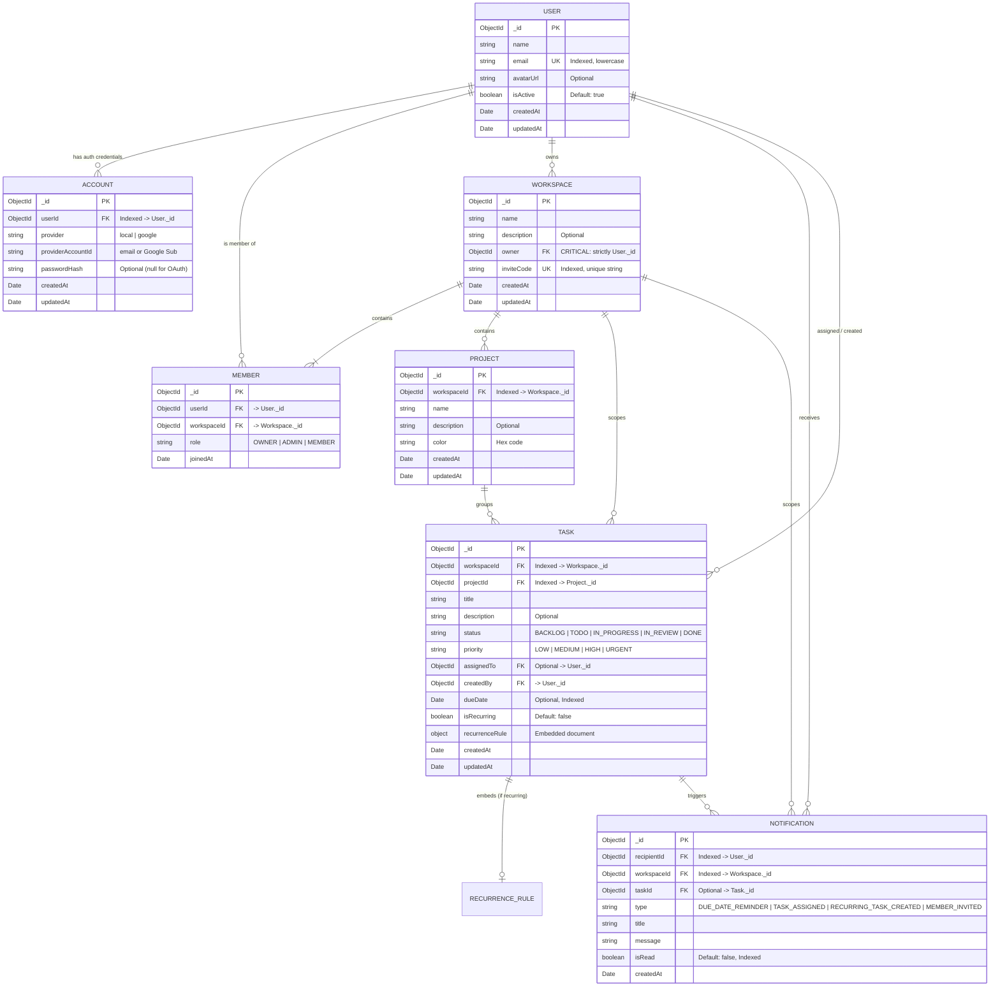

# Workflo — Database Schema & Entity Relationship Design

> **Phase 3 Deliverable**: Architectural blueprint of all database collections, fields, indexes, relationships, and cascade behaviors before writing Mongoose code.

---

## 1. Entity-Relationship Diagram (ERD)



---

## 2. Collection Specifications & Indexes

### A. `users`
* **Purpose:** Core profile for a human user.
* **Fields:**
  * `_id`: `ObjectId` (Primary Key)
  * `name`: `string`, required, trimmed
  * `email`: `string`, required, unique, lowercase, trimmed
  * `avatarUrl`: `string`, optional
  * `isActive`: `boolean`, default: `true`
  * `timestamps`: `createdAt`, `updatedAt`
* **Indexes:**
  * `createIndex({ email: 1 }, { unique: true })`

### B. `accounts`
* **Purpose:** Separates authentication credentials from the public user profile. Enables multi-provider auth (Local Email/Password + Google OAuth) without cluttering the `User` model or risking password hash leaks in user queries.
* **Fields:**
  * `_id`: `ObjectId` (Primary Key)
  * `userId`: `ObjectId` (ref: `User`), required
  * `provider`: `string` (`"local"` | `"google"`), required
  * `providerAccountId`: `string`, required (Email for local, Google sub ID for OAuth)
  * `passwordHash`: `string`, required if provider is `"local"`, null if OAuth
  * `timestamps`: `createdAt`, `updatedAt`
* **Indexes:**
  * `createIndex({ provider: 1, providerAccountId: 1 }, { unique: true })`
  * `createIndex({ userId: 1 })`

### C. `workspaces`
* **Purpose:** Top-level tenant / team boundary. All projects and tasks belong to a workspace.
* **Fields:**
  * `_id`: `ObjectId` (Primary Key)
  * `name`: `string`, required, trimmed
  * `description`: `string`, optional
  * `owner`: `ObjectId` (ref: `User`), required. **Invariant: Must always point to `User._id`.**
  * `inviteCode`: `string`, required, unique
  * `timestamps`: `createdAt`, `updatedAt`
* **Indexes:**
  * `createIndex({ owner: 1 })`
  * `createIndex({ inviteCode: 1 }, { unique: true })`

### D. `members`
* **Purpose:** Junction collection linking users to workspaces with their assigned role.
* **Fields:**
  * `_id`: `ObjectId` (Primary Key)
  * `userId`: `ObjectId` (ref: `User`), required
  * `workspaceId`: `ObjectId` (ref: `Workspace`), required
  * `role`: `string` enum (`"OWNER"`, `"ADMIN"`, `"MEMBER"`), default: `"MEMBER"`
  * `joinedAt`: `Date`, default: `Date.now`
* **Indexes:**
  * `createIndex({ workspaceId: 1, userId: 1 }, { unique: true })` (Prevents a user from joining the same workspace twice)
  * `createIndex({ userId: 1 })` (Fast lookup of all workspaces a user belongs to)

### E. `projects`
* **Purpose:** Grouping tasks within a workspace.
* **Fields:**
  * `_id`: `ObjectId` (Primary Key)
  * `workspaceId`: `ObjectId` (ref: `Workspace`), required
  * `name`: `string`, required, trimmed
  * `description`: `string`, optional
  * `color`: `string`, default: `"#6366F1"`
  * `timestamps`: `createdAt`, `updatedAt`
* **Indexes:**
  * `createIndex({ workspaceId: 1 })`
  * `createIndex({ workspaceId: 1, name: 1 })` (Compound index for filtering within a workspace)

### F. `tasks`
* **Purpose:** Actionable work items.
* **Fields:**
  * `_id`: `ObjectId` (Primary Key)
  * `workspaceId`: `ObjectId` (ref: `Workspace`), required
  * `projectId`: `ObjectId` (ref: `Project`), required
  * `title`: `string`, required, trimmed
  * `description`: `string`, optional
  * `status`: `string` enum (`"BACKLOG"`, `"TODO"`, `"IN_PROGRESS"`, `"IN_REVIEW"`, `"DONE"`), default: `"TODO"`
  * `priority`: `string` enum (`"LOW"`, `"MEDIUM"`, `"HIGH"`, `"URGENT"`), default: `"MEDIUM"`
  * `assignedTo`: `ObjectId` (ref: `User`), optional
  * `createdBy`: `ObjectId` (ref: `User`), required
  * `dueDate`: `Date`, optional
  * `isRecurring`: `boolean`, default: `false`
  * `recurrenceRule`: Embedded subdocument:
    * `frequency`: `"daily"` | `"weekly"` | `"monthly"`
    * `interval`: `number` (e.g., 1 = every week, 2 = every 2 weeks)
    * `endDate`: `Date`, optional
    * `lastRunAt`: `Date`, optional
    * `nextRunAt`: `Date`, optional
  * `timestamps`: `createdAt`, `updatedAt`
* **Indexes:**
  * `createIndex({ workspaceId: 1, projectId: 1 })`
  * `createIndex({ assignedTo: 1 })`
  * `createIndex({ dueDate: 1 })` (Enables efficient background reminder queries)
  * `createIndex({ isRecurring: 1, "recurrenceRule.nextRunAt": 1 })` (Enables worker scheduling queries)

### G. `notifications`
* **Purpose:** Feed of in-app alerts and delivery history.
* **Fields:**
  * `_id`: `ObjectId` (Primary Key)
  * `recipientId`: `ObjectId` (ref: `User`), required
  * `workspaceId`: `ObjectId` (ref: `Workspace`), required
  * `taskId`: `ObjectId` (ref: `Task`), optional
  * `type`: enum (`"DUE_DATE_REMINDER"`, `"TASK_ASSIGNED"`, `"RECURRING_TASK_CREATED"`, `"MEMBER_INVITED"`)
  * `title`: `string`, required
  * `message`: `string`, required
  * `isRead`: `boolean`, default: `false`
  * `createdAt`: `Date`, default: `Date.now`
* **Indexes:**
  * `createIndex({ recipientId: 1, isRead: 1, createdAt: -1 })` (Fast fetch of user unread notifications)

---

## 3. Cascade Deletion Strategy

Because MongoDB is a document database without built-in relational cascading foreign keys, we define explicit application-level cascade rules in service hooks / transactions:

| When deleting... | Application Cascade Action |
| :--- | :--- |
| **Workspace** | 1. Delete all `members` with matching `workspaceId`<br>2. Delete all `projects` with matching `workspaceId`<br>3. Delete all `tasks` with matching `workspaceId`<br>4. Delete all `notifications` with matching `workspaceId`<br>5. Remove any scheduled BullMQ repeatable/delayed jobs associated with tasks in this workspace |
| **Project** | 1. Delete all `tasks` with matching `projectId`<br>2. Cancel any pending reminder BullMQ jobs for those tasks |
| **Task** | 1. Delete notifications referencing `taskId`<br>2. Cancel pending BullMQ delayed reminder job (`jobId: reminder-${taskId}`) |
| **User** | 1. Check if user is the sole `OWNER` of any workspace (block deletion or require transfer)<br>2. Remove user from `members`<br>3. Delete user's `accounts`<br>4. Unassign user from `tasks.assignedTo` (set to `null`) |

---

## 4. Prototype Bug Post-Mortem & Prevention

In the earlier prototype ("Zentra"), `workspace.owner` was assigned the `_id` of a `Role` or `Member` record rather than the `_id` of the `User`. This resulted in:
- `req.user._id === workspace.owner` checks failing silently.
- Complicated workarounds like looking up the member table just to find who owns the workspace.

**Our Prevention:**
1. In `Workspace` schema:
   ```typescript
   owner: { type: Schema.Types.ObjectId, ref: 'User', required: true }
   ```
2. When creating a workspace in `workspace.service.ts`:
   ```typescript
   const workspace = await Workspace.create({
     name,
     owner: userId, // userId strictly comes from req.user._id
     inviteCode: nanoid(10),
   });
   ```
3. TypeScript compiler + Zod validation will reject any payload attempting to pass a non-User identifier.
